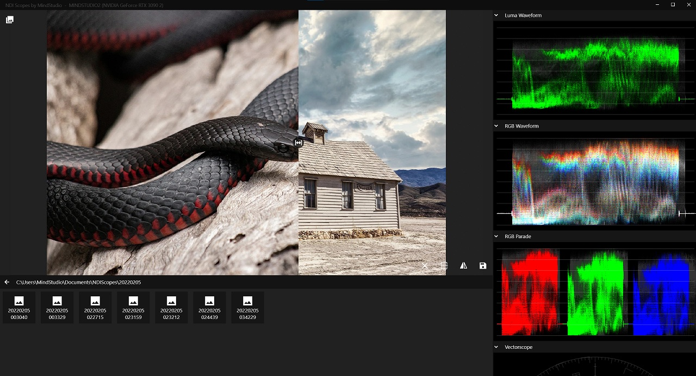

# NDIScopes

An open source Windows application to display several diffrent Scopes for an NDI Input built with [Flutter](https://flutter.dev). 




## Roadmap

### Platform Support

- [x] Windows
- [ ] Linux
- [ ] MacOS

### Features

- [x] Waveforms
  - [x] Luma Waveform
  - [x] RGB Waveform
  - [x] RGB Parade
  - [x] UV Vectorscope  
- [x] Reference Frame
  - [x] Save/Load
  - [x] Overlay on source as splitscreen
  - [x] Overlay on scopes as background
  - [x] Overlay on scopes as splitscreen
- [x] Draw Masks on source/reference frame
- [ ] Record and graph RGBL ratio over time
- [ ] NDI Codec support
  - [x] UYVY (most common)
  - [ ] UYVA
  - [ ] RGBA
  - [ ] RGBX
  - [x] BGRA (used for still images)
  - [ ] BGRX
  - others are very uncommon IMO

### GPU Support
- NVIDIA
  - [x] CC 8.x **Ampere** RTX 30 Series, RTX A Series,
  - [x] CC 7.x **Volta/Turing** RTX 20 Series, GTX 16 Series, RTX Quadro Series, TITAN RTX, TITAN V
  - [x] CC 6.x **Pascal** GTX 10 Series, Titan X, Quadro
  - [x] CC 5.x **Maxwell** GTX 750 - GTX 980 Ti
  - [x] CC >=3.5 **Kepler** GT 640 - GTX 780 Ti, TITAN Z **NEEDS TESTING!!!**
  - [ ] CC <3.2 not supported by CUDA 11.x
- [ ] AMD
- [ ] other
  

## Download

Download the latest build under [Releases](https://github.com/MindStudioOfficial/ndiscopes/releases).

## Getting Started


This application uses the cross-platform [Flutter](https://flutter.dev/) framework written in [Dart](https://dart.dev/).

### Requirements

The Software uses CUDA to compute the frames and scopes. A **NVIDIA GPU** is required to run this Software.

### Run in Debug-Mode

```powershell
PS ..\ndiscopes> flutter pub get 

PS ..\ndiscopes> flutter run -d windows
```

### Build for Windows

```powershell
PS ..\ndiscopes> flutter build windows --release
```

A few resources to get you started if this is your first Flutter project:

- [Lab: Write your first Flutter app](https://flutter.dev/docs/get-started/codelab)
- [Cookbook: Useful Flutter samples](https://flutter.dev/docs/cookbook)

For help getting started with Flutter, view our
[online documentation](https://flutter.dev/docs), which offers tutorials,
samples, guidance on mobile development, and a full API reference.
