<h1 align="center"> NDIScopes</h1>
<p align="center">
An open source Windows application to display several diffrent scopes/waveforms for an <a href="https://ndi.tv">NDI®</a> input built with <a href="https://flutter.dev">Flutter</a>. 
</p>

<div align="center">

<a href="https://github.com/MindStudioOfficial/ndiscopes/releases">
</a>
<a href="https://github.com/MindStudioOfficial/ndiscopes/releases">
</a>
<!--<a href="">
</a>-->

</div>
<div align="center">

<a href="https://github.com/MindStudioOfficial/ndiscopes/releases">
</a>


</div>
<div align="center">

<a href="https://github.com/MindStudioOfficial/ndiscopes">
</a>
<a href="https://github.com/MindStudioOfficial/ndiscopes">
</a>

</div>
<br>

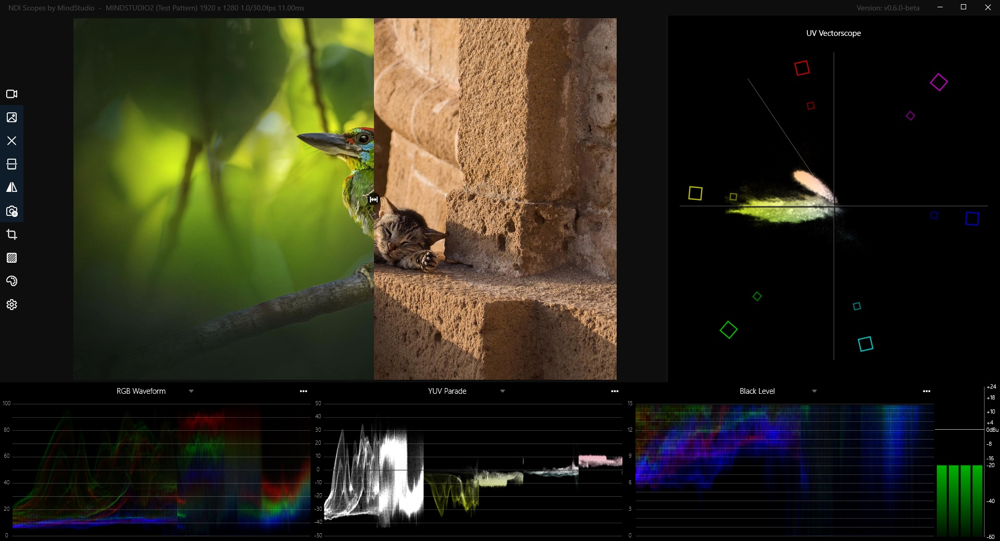

| Luminance: 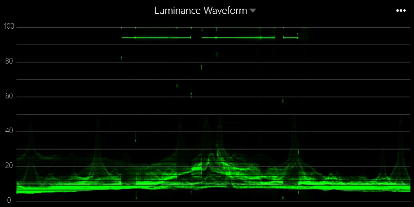 | RGB Overlayed: 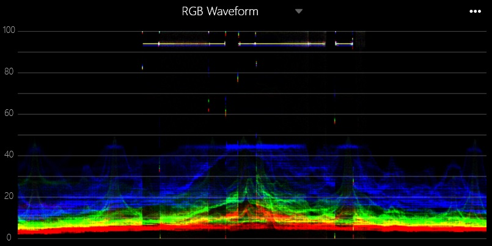 | RGB Parade:  |
| ---------------------------------- | -------------------------------- | --- |
| **15% RGB Blacklevel:**  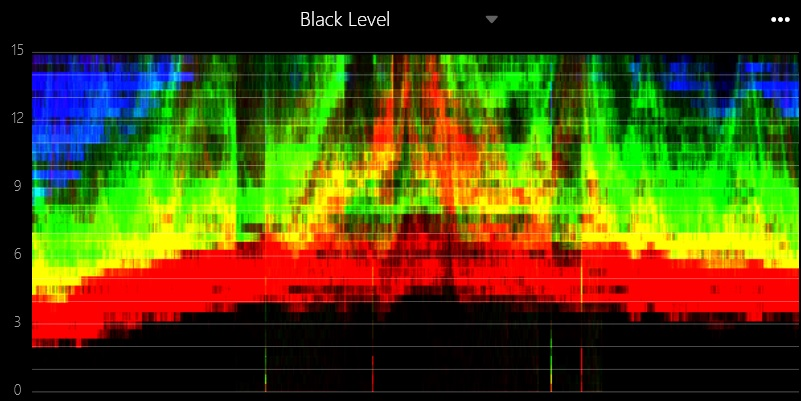 | **YCbCr Parade:** 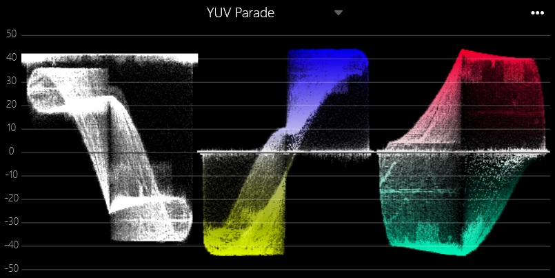 | **YUV Vectorscope:** 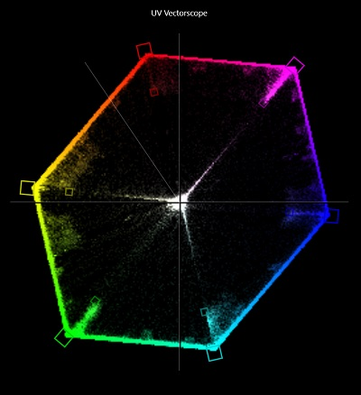 |
| **With Alpha background:**  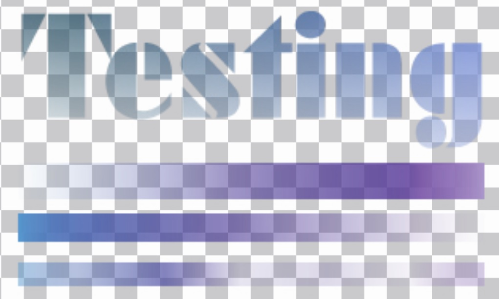 |  **Without Alpha Background:**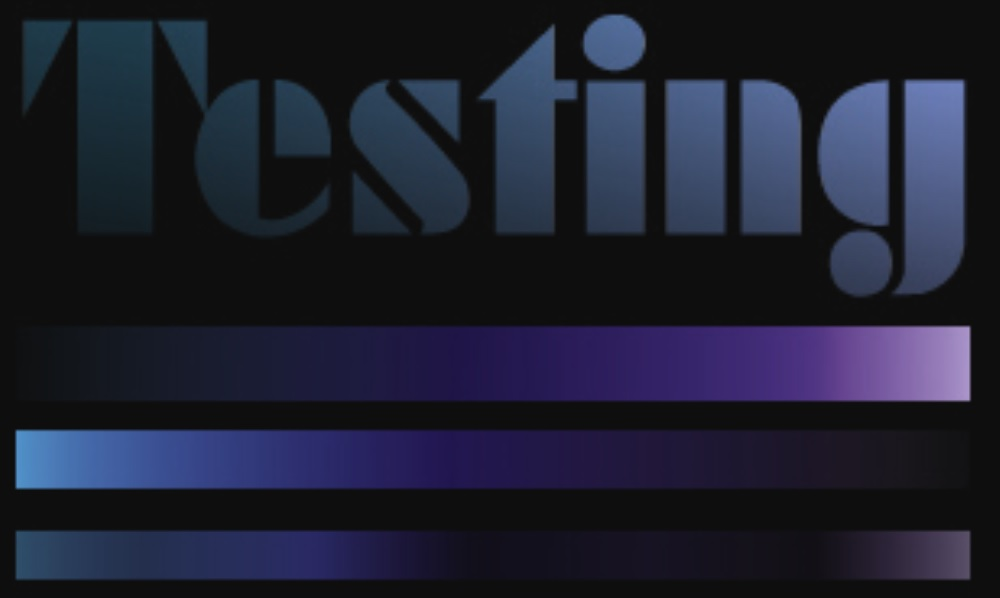 | **Audiometers dBu:** <br>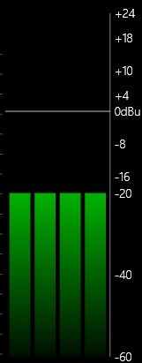 |

| False Color: 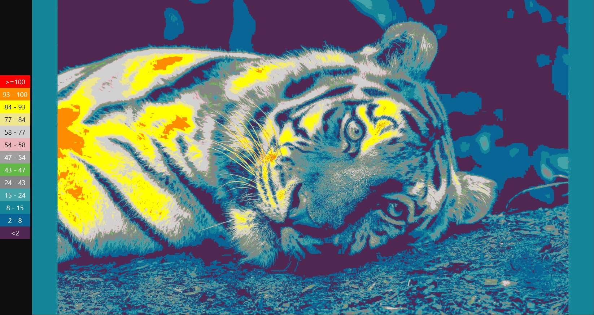 | Splitscreen: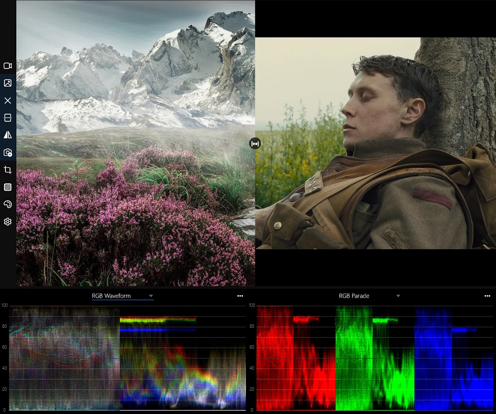 |
| --- | --- |

## Requirements

The software uses **CUDA** to compute the frames and scopes. A **NVIDIA GPU** is required to run this software. See *GPU Support* to see exaxtly what GPUs are supported.

## Platform Support


## Features

- Waveforms/Scopes
  - [x] Luma Waveform
  - [x] RGB Waveform
  - [x] RGB Parade
  - [x] UV Vectorscope
  - [x] False-Color display of source and reference overlay
  - [x] YUV Parade
  - [ ] Color Space Coverage
- Settings
  - [x] Scale vectorscope x0.5 to x5
  - [x] Toggle waveform scale labels
  - [x] Waveform scale as percentage
  - [x] Waveform scale as 8Bit value
  - [x] Save and load settings on startup
  - [x] Enable Audiometer 
  - [x] Select Audio Device
- [x] Reference Frame
  - [x] Save/Load
  - [x] Overlay on source as splitscreen
  - [x] Overlay on scopes as splitscreen
  - [x] Show thumbnails in frame browser
- [x] Draw Masks on source/reference frame
- Audio
  - [x] Audiometer for every audio channel of the NDI source in dBu scale
  - [x] Audio playback to default audio device (toggleable) 
  - [x] Selectable audio device
  - [ ] Audio channel routing
  - [ ] Audio waveform
  - [ ] Audio spectrum
- NDI Codec support
  - [x] UYVY (most common, fastest)
  - [x] BGRA (stills and alpha)
- [ ] NDI Output

## Keyboard Shortcuts

- <kbd>C</kbd> Toggle False `C`olor
- <kbd>T</kbd> Toggle `T`ransparency Grid
- <kbd>X</kbd> Toggle Settings
- <kbd>B</kbd> Toggle Frame `B`rowser
- <kbd>M</kbd> Toggle `M`ask
- <kbd>+</kbd> Capture new Reference Frame
- <kbd>S</kbd> Select `S`ource
- <kbd>Del</kbd> Disable Reference Frame Overlay
- <kbd>D</kbd> Toggle Split `D`irection
- <kbd>F</kbd> `F`lip Split Side

(Feel free to suggest alternative shortcuts as a Feature Request Issue)

## GPU Support
- NVIDIA
  - [x] CC 8.x **Ampere** RTX 30 Series, RTX A Series,
  - [x] CC 7.x **Volta/Turing** RTX 20 Series, GTX 16 Series, RTX Quadro Series, TITAN RTX, TITAN V
  - [x] CC 6.x **Pascal** GTX 10 Series, Titan X, Quadro
  - [x] CC 5.x **Maxwell** GTX 750 - GTX 980 Ti
  - [x] CC >=3.5 **Kepler** GT 640 - GTX 780 Ti, TITAN Z 
  - [ ] CC <3.2 not supported by CUDA 11.x
- [ ] AMD
- [ ] other
  

## Download

Download the latest build under [Releases](https://github.com/MindStudioOfficial/ndiscopes/releases).

## Contribute

Please read [Contributing](https://github.com/MindStudioOfficial/ndiscopes/blob/main/CONTRIBUTING.md)

## Getting Started

For licensing reasons I am not able to provide the **SDK Files** directly. You have to source them yourself from [here](https://www.ndi.tv/sdk/#download).

The `.dll` file from the SDK goes into the `bin` folder once you have downloaded it.

This application uses the cross-platform [Flutter](https://flutter.dev/) framework written in [Dart](https://dart.dev/).

While building, flutter puts the `bin` folder containing the necessary libraries in an assets folder which is incorrect. You will have to manually move the `bin` folder back to the root of the release folder once built.

### Run in Debug-Mode

```powershell
PS ..\ndiscopes> flutter pub get 

PS ..\ndiscopes> flutter run -d windows
```

### Build for Windows

```powershell
PS ..\ndiscopes> flutter build windows --release
```

A few resources to get you started if this is your first Flutter project:

- [Lab: Write your first Flutter app](https://flutter.dev/docs/get-started/codelab)
- [Cookbook: Useful Flutter samples](https://flutter.dev/docs/cookbook)

For help getting started with Flutter, view our
[online documentation](https://flutter.dev/docs), which offers tutorials,
samples, guidance on mobile development, and a full API reference.

### License

[License Agreement](license.md)
