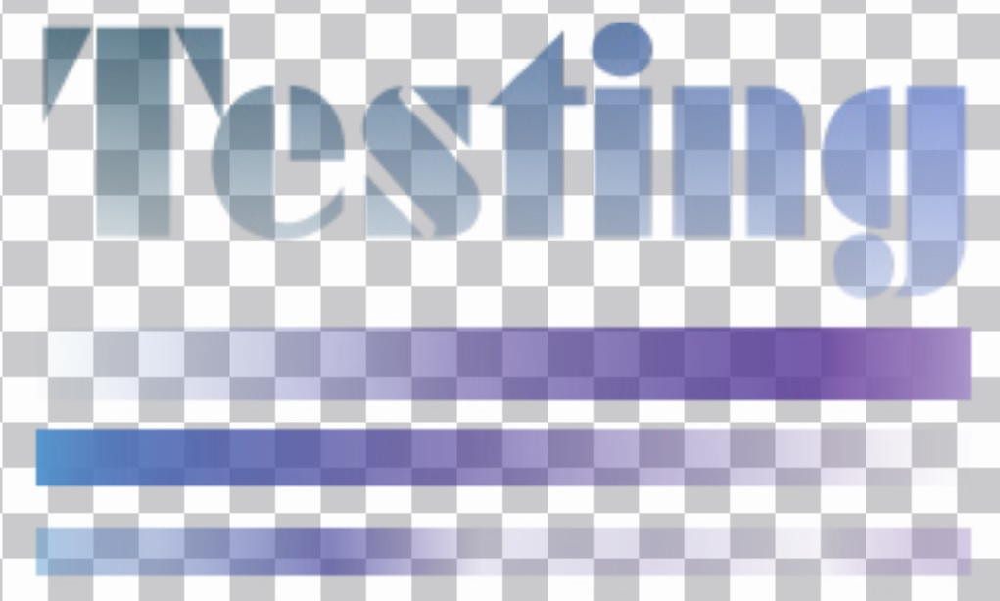

<h1 align="center"> NDIScopes</h1>

Use several different <a href="https://github.com/MindStudioOfficial/ndiscopes_releases#waveformsscopes">Waveforms/Scopes</a> to analyze a <a href="https://ndi.tv">NDI®</a> Stream. 

<!---->

 

| Luminance:  | RGB Overlayed:  | RGB Parade:  |
| ---------------------------------- | -------------------------------- | --- |
| **15% RGB Blacklevel:**   | **YCbCr Parade:**  | **YUV Vectorscope:**  |
| **With Alpha background:**   |  **Without Alpha Background:** | **Audiometers dBu:**   |

| False Color:  | Splitscreen: |
| --- | --- |

## Requirements

The software uses **CUDA** to compute the frames and scopes. A **NVIDIA GPU** is required to run this software. See *GPU Support* to see exaxtly what GPUs are supported.

## Platform Support

## Features

### Waveforms/Scopes
- [x] Luminance Waveform
- [x] RGB Waveform
- [x] RGB Parade
- [x] CbCr/UV Vectorscope
- [x] False Color
- [x] YUV Parade
- [x] CIE 1931 Chromaticity
- [x] RGBA Channel Isolation

### Settings
- [x] Scale vectorscope x0.5 to x5
- [x] Toggle waveform scale labels
- [x] Waveform scale as percentage
- [x] Waveform scale as 8Bit value
- [x] Save and load settings on startup
- [x] Enable Audiometer 
- [x] Select Audio Device

### Audio
- [x] Audiometer for every audio channel of the NDI source in dBu scale
- [x] Audio playback to default audio device (toggleable) 
- [x] Selectable audio device
- [ ] Audio channel routing
- [ ] Audio waveform
- [ ] Audio spectrum

### Other
- [x] Reference Frame
  - [x] Save/Load
  - [x] Overlay on source as splitscreen
  - [x] Overlay on scopes as splitscreen
  - [x] Show thumbnails in frame browser
- [x] Draw Masks on source frame
- [X] View Timecode
- [X] View Embeded Metadata
- [ ] NDI Output
### NDI Codec support
- [x] UYVY (most common, fastest)
- [x] BGRA (stills and alpha)

## Keyboard Shortcuts

- <kbd>C</kbd> Toggle False `C`olor
- <kbd>T</kbd> Toggle `T`ransparency Grid
- <kbd>X</kbd> Toggle Settings
- <kbd>B</kbd> Toggle Frame `B`rowser
- <kbd>M</kbd> Toggle `M`ask
- <kbd>+</kbd> Capture new Reference Frame
- <kbd>S</kbd> Select `S`ource
- <kbd>Del</kbd> Disable Reference Frame Overlay
- <kbd>D</kbd> Toggle Split `D`irection
- <kbd>F</kbd> `F`lip Split Side

(Feel free to suggest alternative shortcuts as a Feature Request Issue)

## GPU Support
- NVIDIA
  - [x] CC 8.x **Ampere** RTX 30 Series, RTX A Series,
  - [x] CC 7.x **Volta/Turing** RTX 20 Series, GTX 16 Series, RTX Quadro Series, TITAN RTX, TITAN V
  - [x] CC 6.x **Pascal** GTX 10 Series, Titan X, Quadro
  - [x] CC 5.x **Maxwell** GTX 750 - GTX 980 Ti
  - [x] CC >=3.5 **Kepler** GT 640 - GTX 780 Ti, TITAN Z 
  - [ ] CC <3.2 not supported by CUDA 11.x
- [ ] AMD
- [ ] other
  

## Download

Download the latest version under [Releases](https://github.com/MindStudioOfficial/ndiscopes_releases/releases).

## License

[License Agreement](license.md)
